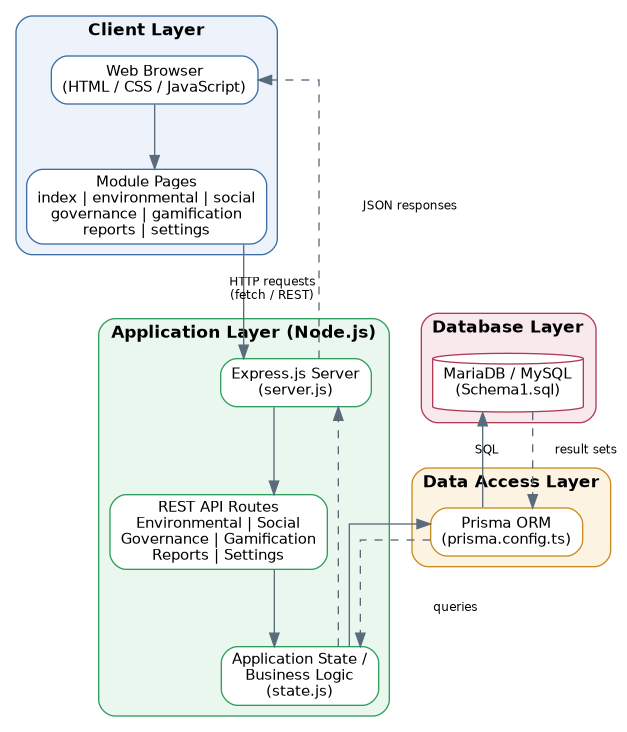
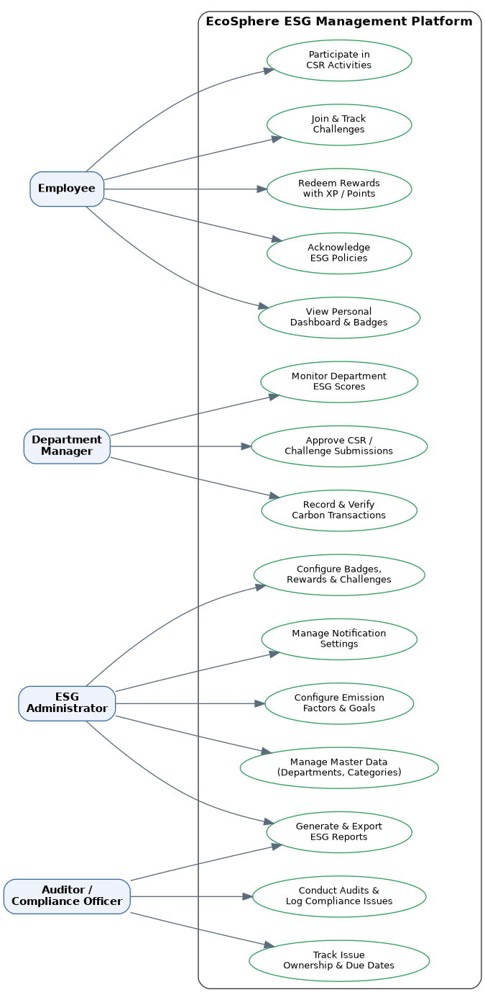

# EcoSphere — ESG Management Platform

EcoSphere is an Environmental, Social, and Governance (ESG) management platform designed to be embedded directly into day-to-day enterprise operations. It consolidates carbon accounting, employee participation, and compliance tracking into a single dashboard, and uses gamification to drive sustained employee engagement with sustainability goals.

Repository: [VaswaniNeel/oddo-july-26](https://github.com/VaswaniNeel/oddo-july-26)

---

## Table of Contents

1. [Background](#background)
2. [Problem Statement](#problem-statement)
3. [Core Modules](#core-modules)
4. [Architecture](#architecture)
5. [Use Case Diagram](#use-case-diagram)
6. [Business Workflow](#business-workflow)
7. [Data Model](#data-model)
8. [Technology Stack](#technology-stack)
9. [Project Structure](#project-structure)
10. [Getting Started](#getting-started)
11. [Configuration and Business Rules](#configuration-and-business-rules)
12. [Reports](#reports)
13. [Roadmap](#roadmap)
14. [Contributing](#contributing)
15. [License](#license)

---

## Background

Environmental, Social, and Governance performance has become a critical dimension of modern business operations. Organizations are expected to monitor carbon emissions, promote employee well-being, and maintain governance compliance. While most ERP systems collect operational data, ESG reporting on top of that data is typically manual, disconnected from daily operations, and difficult to monitor in real time.

EcoSphere addresses this gap by integrating ESG measurement directly into ERP-style operational workflows, rather than treating it as a separate, after-the-fact reporting exercise.

## Problem Statement

Build an ESG management platform that enables organizations to measure, manage, and improve their Environmental, Social, and Governance performance. The platform integrates operational data, employee participation, and compliance activity into a unified dashboard, while using gamification to encourage sustainability behavior across the organization.

## Core Modules

| Module | Description |
|---|---|
| **Environmental** | Carbon accounting, emission factors, sustainability goals, and carbon reports |
| **Social** | CSR activities, employee participation, diversity metrics, and engagement tracking |
| **Governance** | Policies, audits, compliance tracking, and governance reports |
| **Gamification** | Challenges, XP, badges, rewards, and leaderboards |

---

## Architecture

EcoSphere follows a layered web application architecture: a browser-based client renders module-specific HTML pages, which communicate with an Express.js server over REST-style HTTP calls. Business logic and application state are handled in the application layer, data access is mediated through Prisma ORM, and persistence is handled by a MariaDB/MySQL relational database.



**Layer summary:**

- **Client Layer** — Static HTML/CSS/JavaScript pages for each functional module (`index.html`, `environmental.html`, `social.html`, `governance.html`, `gamification.html`, `reports.html`, `settings.html`), styled through `style.css`.
- **Application Layer** — A Node.js runtime with an Express.js server (`server.js`) exposing REST endpoints per module, backed by shared application logic and state handling (`state.js`).
- **Data Access Layer** — Prisma ORM (`prisma.config.ts`) provides a typed data access interface and manages schema migrations against the relational database.
- **Database Layer** — MariaDB/MySQL stores master data and transactional data, with the base schema defined in `Schema1.sql`.

## Use Case Diagram

The platform serves four primary actor types, each interacting with a distinct subset of use cases: employees engaging with sustainability activities, department managers overseeing team performance, ESG administrators configuring the platform, and auditors managing compliance.



| Actor | Primary Use Cases |
|---|---|
| **Employee** | Participate in CSR activities, join and track challenges, redeem rewards, acknowledge ESG policies, view personal dashboard and badges |
| **Department Manager** | Monitor department ESG scores, approve CSR/challenge submissions, record carbon transactions |
| **ESG Administrator** | Configure emission factors and goals, manage master data, configure badges/rewards/challenges, generate reports, manage notification settings |
| **Auditor / Compliance Officer** | Conduct audits, log and track compliance issues, generate reports |

---

## Business Workflow

ESG scoring in EcoSphere flows from operational configuration through to an organization-wide score, aggregated bottom-up from department-level activity.

```
Master Configuration
        │
        ▼
Departments · Categories · Emission Factors · Products
Goals · Policies · Challenges
        │
        ▼
Daily Business Operations
(Purchase · Manufacturing · Expenses · Fleet)
        │
        ▼
Carbon Transactions
        │
        ▼
Employee Participation (CSR) · Challenge Participation
Policy Acknowledgements · Audits
        │
        ▼
Environmental Score · Social Score · Governance Score
        │
        ▼
Department Total Score
        │
        ▼
Overall ESG Score
(weighted average of Department Total Scores —
default weighting: Environmental 40% / Social 30% / Governance 30%,
configurable per organization)
        │
        ▼
Organization Dashboard & Reports
```

## Data Model

### Master Data

| Model | Purpose | Key Fields |
|---|---|---|
| Department | Organizational hierarchy and ESG ownership | Name, Code, Head, Parent Department, Employee Count, Status |
| Category | Shared category values across Social and Gamification modules (CSR Activity Category, Challenge Category) | Name, Type (CSR Activity / Challenge), Status |
| Emission Factor | Carbon values used during emission calculations | — |
| Product ESG Profile | ESG information linked to products | — |
| Environmental Goal | Sustainability targets | — |
| ESG Policy | Governance policies | — |
| Badge | Employee achievements | Name, Description, Unlock Rule, Icon |
| Reward | Redeemable incentives | Name, Description, Points Required, Stock, Status |

### Transactional Data

| Model | Purpose | Key Fields |
|---|---|---|
| Carbon Transaction | Calculated emissions from ERP operations | — |
| CSR Activity | Social initiatives organized by the company | — |
| Employee Participation | Tracks employee involvement in CSR activities only | Employee, Activity, Proof, Approval Status, Points Earned, Completion Date |
| Challenge | Sustainability challenges | Title, Category, Description, XP, Difficulty, Evidence Required, Deadline, Status (Draft / Active / Under Review / Completed / Archived) |
| Challenge Participation | Tracks employee progress within challenges only | Challenge, Employee, Progress, Proof, Approval, XP Awarded |
| Policy Acknowledgement | Employee policy acceptance | — |
| Audit | Governance audits | — |
| Compliance Issue | Governance violations | Audit, Severity, Description, Owner, Due Date, Status |
| Department Score | Aggregated ESG performance per department | Department, Environmental Score, Social Score, Governance Score, Total Score |

The full relational schema is defined in [`Schema1.sql`](./Schema1.sql), with data access and migrations managed through Prisma.

---

## Technology Stack

| Layer | Technology |
|---|---|
| Frontend | HTML5, CSS3, vanilla JavaScript |
| Backend | Node.js, Express.js |
| ORM | Prisma (with MariaDB adapter) |
| Database | MariaDB / MySQL |
| Configuration | dotenv |

Key dependencies (see [`package.json`](./package.json)):

- `express` — HTTP server and routing
- `@prisma/client`, `@prisma/adapter-mariadb`, `prisma` — data access and schema management
- `mariadb`, `mysql2` — database drivers
- `body-parser` — request payload parsing
- `dotenv` — environment variable management

## Project Structure

```
oddo-july-26/
├── index.html              # Application entry point / landing dashboard
├── environmental.html      # Environmental module UI
├── social.html              # Social module UI
├── governance.html         # Governance module UI
├── gamification.html       # Gamification module UI
├── reports.html            # Reporting and export UI
├── settings.html           # Settings and administration UI
├── style.css                # Shared application styling
├── state.js                 # Client/application state handling
├── server.js                 # Express.js server and API routes
├── prisma.config.ts         # Prisma ORM configuration
├── Schema1.sql               # Relational database schema
├── package.json
├── package-lock.json
└── .gitignore
```

## Getting Started

### Prerequisites

- Node.js (LTS recommended)
- npm
- A running MariaDB or MySQL instance

### Installation

```bash
# Clone the repository
git clone https://github.com/VaswaniNeel/oddo-july-26.git
cd oddo-july-26

# Install dependencies
npm install
```

### Environment Configuration

Create a `.env` file in the project root with your database connection details, for example:

```
DATABASE_URL="mysql://<user>:<password>@<host>:<port>/<database>"
```

### Database Setup

```bash
# Apply the base schema
mysql -u <user> -p <database> < Schema1.sql

# Or, if managing schema changes through Prisma:
npx prisma generate
npx prisma db push
```

### Running the Application

```bash
node server.js
```

The application will be served according to the configuration in `server.js`; open `index.html`'s served route in your browser to access the dashboard.

---

## Configuration and Business Rules

The following behaviors are core to the platform and are not optional, since they directly support the primary modules:

- **Reward Redemption** — Employees redeem earned Points/XP for a Reward from the catalog, subject to stock availability. Redemption deducts the corresponding Points from the employee's balance.
- **Notification System** — In-app and/or email notifications are sent for at minimum: new compliance issues raised, CSR/Challenge approval decisions, policy acknowledgement reminders, and badge unlocks. Configurable through Settings → Notification Settings.
- **Auto Emission Calculation** — When enabled, Carbon Transactions are calculated automatically from linked Purchase, Manufacturing, Expense, and Fleet records using the relevant Emission Factor, without manual entry.
- **Evidence Requirement** — When enabled, CSR Activity participation cannot be marked Approved without an attached proof file.
- **Badge Auto-Award** — When enabled, a Badge is automatically assigned to an employee as soon as their XP, completed-challenge count, or other tracked metric satisfies that Badge's Unlock Rule, with no manual admin action required.
- **Compliance Issue Ownership** — Every Compliance Issue must have an assigned Owner and a Due Date. Issues that pass their Due Date while still Open are flagged and feed into the Notification System.

## Reports

EcoSphere generates the following report types, each filterable by Department, Date Range, Module, Employee, Challenge, and ESG Category:

- Environmental Report
- Social Report
- Governance Report
- ESG Summary Report
- Custom Report Builder — combine filters and export as PDF, Excel, or CSV

## Roadmap

The following enhancements are identified as candidates for future iterations:

- Department ESG rankings
- Enhanced smart dashboard visualizations
- Mobile-responsive interface

## Contributing

Contributions are welcome. Please open an issue to discuss significant changes before submitting a pull request, and ensure any schema changes are reflected in both `Schema1.sql` and the Prisma configuration.

## License

This project is licensed under the ISC License, as declared in `package.json`. Update this section if a different license applies.
